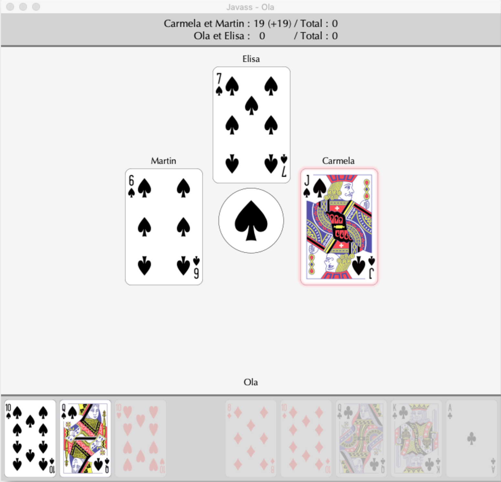

# Jass Game

This card game was developed in Java and made for a university course project. It simulates a version of the Swiss card game **Jass** and supports both human and computer players in local or online environments, enabling multiple human players to join remotely.

## Game Overview
In Jass, four players are split into two teams and compete in rounds using a 36-card deck. Players aim to reach a set number of points (usually 1000) to win the game. Each round is composed of "tricks," and an assigned trump suit changes gameplay dynamics, providing higher value to certain cards.

## Key Features
- **Single-Player Mode**: One human player competes against three AI players (simulated with Monte Carlo method).
- **Multiplayer Mode**: Multiple human players can join from separate computers on the same network.
- **Client-Server Architecture**: The server oversees the game flow, manages scoring, and runs the AI players. Clients manage the interface for each human player.

## Technologies
The project is implemented in Java with a focus on network-based multiplayer functionality and a graphical user interface for an immersive experience.

